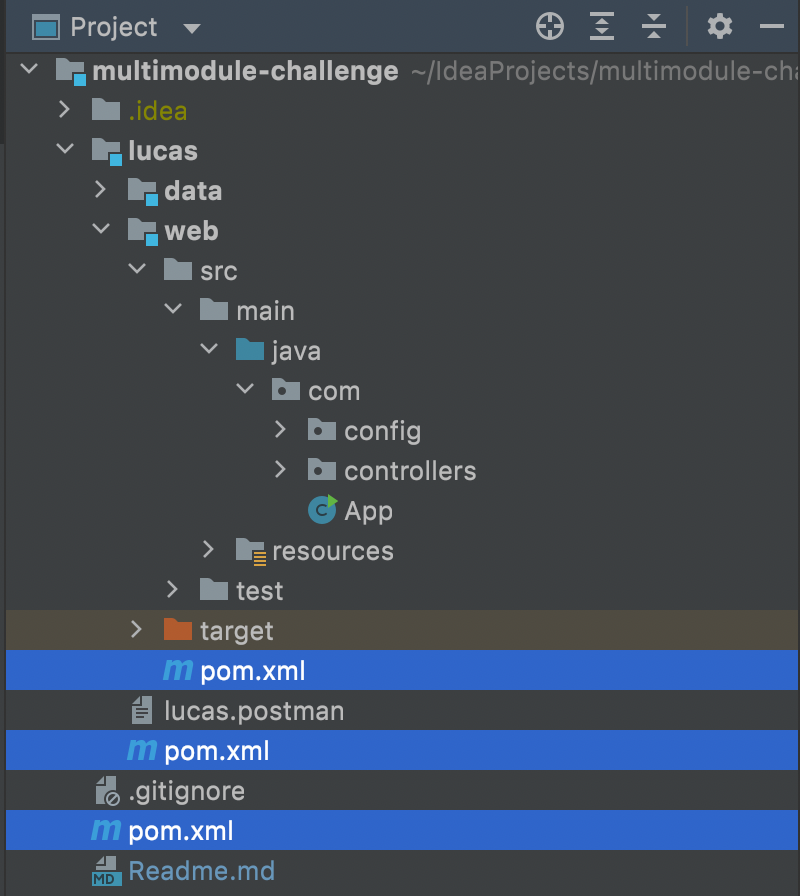
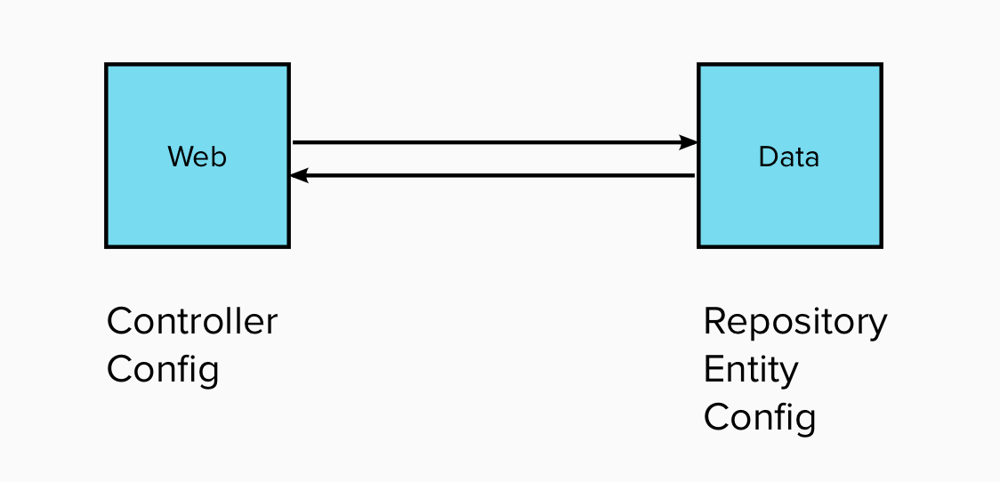
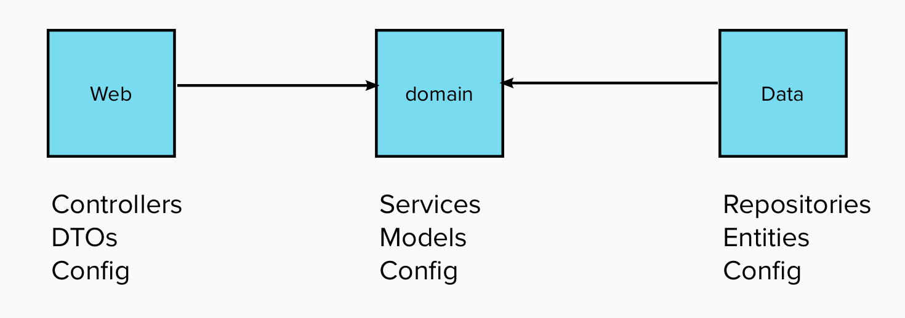

# Maven Multi-Module Challenge

Maven Multi-Module feature promotes modularity and dependency management.
Its use allows us to reuse components and points to separation of concerns.
Apart from that, you can evolve the modules all together or as separate units!

For further details read this [doc](https://maven.apache.org/guides/mini/guide-multiple-modules-4.html).

## Implementation
When working with multi-modules projects there are 2 important concepts:

| Concept | Description |
| ------- | ----------- |
| Inheritance | As in OOP, inheritance means inherit what is defined in the parent. |
| Aggregation | It means we can manage the different modules as a whole.  |

### POM Inheritance
```
<parent>
    <artifactId>artifact-name</artifactId>
    <groupId>com.fulcrum</groupId>
    <version>1.0-SNAPSHOT</version>
</parent>
```

### POM Aggregation
```
<modules>
    <module>artifact-a</module>
    <module>artifact-b</module>
</modules>
```

## Goal
Create a module that will represent your own project and inside this module, create sub-modules for separation of concerns.

### Project Structure Sample


In this example, we see a pom file for the main project, then one for a particular project (lucas) and finally one per 
each module inside.

### Dependency Diagram


## Time to Code! 😃
We can improve the diagram above in order to separate also domain logic.
For that, we will need to add a new module. 

The most important thing about this new module is that it should know nothing about **implementation details**.
This means, this module will know nothing about web and data stuff.
Take a look to the dependency diagram:



So, as DTOs are part of web module, in our services (domain-module) we should know nothing about DTOs!
You can apply the same principle to entities. Services (domain-module) should know nothing about entities (data-module).

But yes in the reverse. A controller (web-module) should know about models (domain-module) and also a repository 
(data-module) should know about models (domain-module).

## Requirements
Let's go with baby steps 👶

| # | Description |
| --- | ----------- |
| 1 | Create your own module below main module. It should be your name-profile. |
| 2 | Create the web module inside your own module. Create a Profile CRUD with name, age, interests, etc.|
| 3 | Test it! Just web module. |
| 4 | Create the domain-module. Think about conversions between dto and domains. In this module lives the services.|
| 5 | Test it! Just domain module. |
| 6 | Create the data module. Here will live all db stuff. Remember domain should know nothing about this. Maybe in thedomain you will need an interface using domains and in data module implement that! (doing the conversion of entitties2domain) |
| 7 | Test it! Just data module|
| 8 | Take a time and revisit the concepts of configuration management. As you will realize, if it is not properly set, it won't work.|
| 9 | Create a new module under main project with your name-netfilx. Create a crud that allows a new user to register and choose a plan. This service needs to be secured.|
| 10 | Add to name-profile module an operation to manage services (like netflix). if i want to add netflix, i should call to netflix module. I should first register, save the credentials and then use it to add the service plan. The integration between the 2 services will be thru RestTemplate. You should consider different types of responses, e.g 2XX, 4XX, 5XX status codes.|
| 11 | Retry strategy. If Netflix is down, retry 3 times each X seconds.|
| 12 | Improve retry strategy. The first time retry in x seconds, the 2nd in x + 5 and the 3rd in x + 10 seconds.|
| 13 | Test this integration in name-profile module |
| 14 | Play with timeouts when calling to netflix. Apply an strategy when timeout is shot. |
| 15 | Unify name-profile and name-netflix modules in a module with your name.|


